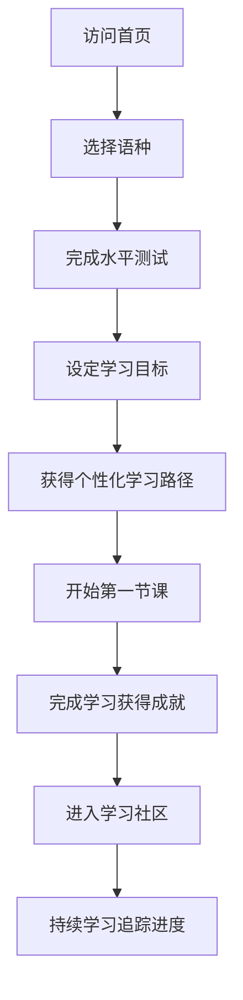
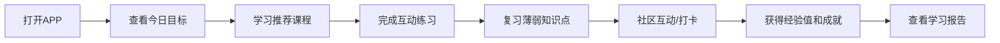

# 多语种在线教育平台 - 产品需求文档（PRD）

## 1. 产品概述

LinguaFlow是一款沉浸式多语种在线学习平台，致力于为学习者提供专业、有趣且高效的语言学习体验。平台支持英语、日语、韩语等多主流语种，通过分级课程体系、智能学习路径和互动式学习模块，帮助用户从零基础到精通的完整学习旅程。

**核心价值：**
- 🎯 个性化学习路径，基于用户水平和目标智能推荐
- 🌍 多语种支持，覆盖全球主流语言
- 📚 分级课程体系，从A1到C2渐进式学习
- 🏆 成就激励系统，游戏化学习提升动力
- 👥 社区互动，与全球学习者共同进步

## 2. 核心功能模块

### 2.1 用户角色

| 角色 | 注册方式 | 核心权限 |
|------|---------|---------|
| 访客 | 无需注册 | 浏览课程介绍、查看公开内容 |
| 注册用户 | 邮箱/手机注册 | 完整学习功能、学习进度追踪、社区互动、成就系统 |
| VIP用户 | 付费升级 | 高级课程、AI智能辅导、专属学习路径 |

### 2.2 主要功能页面

1. **首页** - 平台入口、语种选择、热门课程展示、学习路径推荐
2. **认证页面** - 用户注册、登录、密码找回
3. **个人仪表盘** - 学习概览、进度追踪、今日目标、快速入口
4. **课程中心** - 语种分类、级别筛选、课程列表、课程详情
5. **学习模块** - 单词记忆、语法练习、口语跟读、听力训练
6. **社区中心** - 学习小组、话题讨论、学习日记、问答互助
7. **成就中心** - 成就徽章、等级系统、排行榜、统计数据

## 3. 核心功能详细说明

### 3.1 分级课程体系

**语种支持：**
- 🇬🇧 英语（English）
- 🇯🇵 日语（日本語）
- 🇰🇷 韩语（한국어）

**级别划分：**
- 初级（A1-A2）：日常生活基础对话，500+词汇
- 中级（B1-B2）：工作学习场景运用，2000+词汇
- 高级（C1-C2）：流利交流，深入文化理解，5000+词汇

**课程类型：**
- 基础课程：发音、字母、基础词汇
- 情景课程：旅行、美食、工作、学习
- 专项课程：口语强化、听力提升、写作训练
- 文化课程：历史、风俗、社会现象

### 3.2 互动式学习模块

#### 3.2.1 单词记忆模块
- **闪卡学习**：双面卡片展示，点击翻转查看释义
- **记忆曲线**：基于艾宾浩斯遗忘曲线智能复习
- **词根词缀**：分析单词构成，强化记忆效果
- **例句语境**：每个单词配备真实语境例句
- **发音标注**：显示音标和发音要点

#### 3.2.2 语法练习模块
- **互动讲解**：图文结合的语法规则说明
- **填空练习**：填写正确的单词或短语
- **改错练习**：找出并纠正句子错误
- **造句练习**：使用指定语法点造句
- **即时反馈**：详细的错误解析和正确答案

#### 3.2.3 口语跟读模块
- **智能语音识别**：准确评估发音质量
- **逐句跟读**：播放标准发音后跟读
- **对比分析**：波形对比，直观展示差异
- **发音评分**：多维度评分（清晰度、流利度、语调）
- **跟读回放**：保存录音，随时对比改进

#### 3.2.4 听力训练模块
- **分级听力材料**：匹配不同水平的学习者
- **变速播放**：0.5x-2.0x自由调节
- **分段听力**：逐句听写，难度递进
- **听音选图**：根据听到的内容选择正确图片
- **听写测试**：完整句子听写训练

### 3.3 学习进度追踪

**个人统计：**
- 📊 总学习时长
- 📚 已完成课程数
- 🎯 正确率趋势图
- 🔥 连续学习天数
- 📈 能力雷达图（听说读写四维）

**学习报告：**
- 周报/月报自动生成
- 薄弱点分析
- 学习效率评估
- 进步趋势展示

**目标管理：**
- 每日学习目标（时长/单词数/课程数）
- 学习提醒设置
- 目标达成激励

### 3.4 用户注册与登录

**注册方式：**
- 邮箱注册（密码+验证码）
- 手机号注册（短信验证码）
- 第三方登录（Google、微信）

**登录功能：**
- 邮箱/手机号+密码登录
- 记住登录状态
- 密码找回功能

**用户信息：**
- 头像上传
- 学习目标设置
- 偏好语种选择
- 学习水平自评

### 3.5 个性化学习路径

**智能推荐算法：**
- 基于用户水平测试结果
- 分析学习行为和偏好
- 追踪掌握程度和遗忘曲线
- 考虑学习时间和目标

**推荐内容：**
- 📚 适合难度的下一节课
- 🔄 需要复习的旧知识
- 🎯 针对性强化练习
- 📖 相关拓展学习资源

**自适应调整：**
- 根据学习表现动态调整难度
- 优化每日学习任务分配
- 预测学习周期和达成时间

### 3.6 社区交流系统

**学习小组：**
- 按语种创建学习群组
- 每日学习打卡
- 小组排行榜
- 组内互助问答

**话题讨论：**
- 发布学习心得
- 分享优质资源
- 提问求助
- 评论互动

**学习日记：**
- 记录每日学习内容
- 分享学习心情
- 获得他人鼓励

**问答中心：**
- 发布问题求助
- 回答他人问题
- 采纳最佳答案

### 3.7 成就激励系统

**成就徽章：**
- 🏆 学习成就：完成首个课程、连续学习7天等
- 📚 知识成就：掌握1000词汇、语法满分等
- 🌍 探索成就：学习多语种、探索所有课程类型
- 👥 社区成就：帮助他人、获得点赞

**等级系统：**
- 学习者等级（L1-L60）
- 经验值获取：学习、练习、互助、分享
- 等级权益：解锁高级功能、专属徽章

**排行榜：**
- 总学习时长排行
- 连续学习天数排行
- 完成课程数量排行
- 社区贡献排行

## 4. 核心用户流程

### 4.1 新用户首次使用流程

### 4.2 每日学习流程

## 5. 用户界面设计

### 5.1 设计风格

**整体风格：**
- 🎨 现代简洁，扁平化设计
- 🌈 色彩丰富但和谐统一
- ✨ 微交互动效，提升体验
- 📱 响应式设计，适配多端

**主色调：**
- 🎯 主色：#4F46E5（靛蓝色，代表智慧和学习）
- 🌿 辅助色：#10B981（翠绿色，代表进步和成长）
- ☀️ 强调色：#F59E0B（琥珀色，代表成就和激励）
- 🌙 深色：#1F2937（深灰色，用于文字和背景）

**字体选择：**
- 标题：Poppins（现代感强）
- 正文：Inter（清晰易读）
- 代码/音标：Roboto Mono

**圆角风格：**
- 按钮：rounded-lg（8px）
- 卡片：rounded-xl（12px）
- 模态框：rounded-2xl（16px）

### 5.2 页面布局

**首页布局：**
- 顶部：导航栏（Logo、搜索、语种切换、用户头像）
- Hero区：大Banner展示平台特色语种
- 语种选择区：英语、日语、韩语卡片
- 热门课程区：横向滚动的课程卡片
- 学习路径区：个性化推荐的学习路径
- 底部：页脚信息

**学习模块布局：**
- 左侧：章节导航列表
- 中间：主内容区（课程视频/练习/跟读）
- 右侧：相关资源和练习入口
- 底部：进度条和导航按钮

**社区布局：**
- 顶部：发布入口和筛选标签
- 中间：动态流（帖子卡片）
- 右侧：热门话题和排行榜

### 5.3 交互动效

**页面转场：**
- 淡入淡出：opacity 0→1, 300ms ease
- 滑入滑出：translateY 20px→0, 400ms ease-out

**卡片交互：**
- 悬停放大：scale 1→1.02, 200ms
- 阴影加深：box-shadow增强
- 边框高亮：颜色变化

**按钮反馈：**
- 点击缩放：scale 0.98→1, 100ms
- 背景色变化：150ms ease

**加载动画：**
- 骨架屏：渐变动画效果
- 进度环：SVG stroke动画
- 数字跳动：计数器动画

**成就动画：**
- 徽章获得：弹跳+金光特效
- 升级成功：满屏粒子效果
- 打卡成功：火焰燃烧动画

## 6. 技术需求（非功能性）

### 6.1 性能要求
- 页面首屏加载时间 < 3秒
- 交互响应时间 < 200ms
- 音频加载时间 < 1秒
- 支持1000+并发用户

### 6.2 兼容性
- 浏览器：Chrome、Firefox、Safari、Edge最新2个版本
- 移动端：iOS 12+、Android 8+
- 响应式断点：640px、768px、1024px、1280px

### 6.3 可访问性
- 符合WCAG 2.1 AA标准
- 支持键盘导航
- 屏幕阅读器适配
- 颜色对比度≥4.5:1

## 7. 数据统计与迭代

### 7.1 关键指标（KPI）
- 日活用户（DAU）
- 课程完成率
- 平均学习时长
- 用户留存率（次日、7日、30日）
- 社区互动率

### 7.2 用户反馈
- 课程评分和评论
- 问题反馈表单
- 用户满意度调查

---

**文档版本：** v1.0  
**创建日期：** 2026-05-08  
**负责人：** LinguaFlow产品团队
