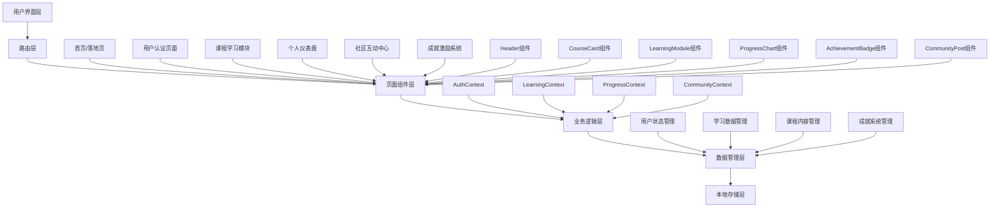
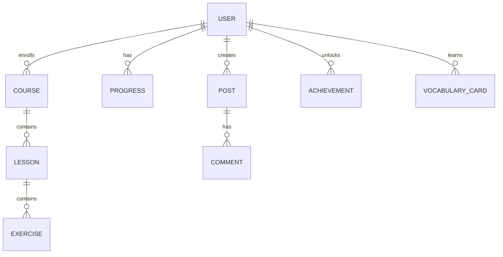

# 多语种在线教育平台 - 技术架构文档

## 1. 系统架构设计



## 2. 技术栈说明

### 2.1 前端技术选型

**核心框架：**
- React 18.x - 现代化的UI组件化开发框架
- TypeScript 5.x - 提供类型安全，提升代码质量
- Vite 5.x - 极速的开发服务器和构建工具

**路由管理：**
- React Router DOM 6.x - 单页面应用路由解决方案

**样式方案：**
- Tailwind CSS 3.x - 原子化CSS框架，快速构建响应式界面
- PostCSS - CSS后处理器
- Autoprefixer - 自动添加浏览器前缀

**状态管理：**
- React Context API - 轻量级全局状态管理
- useReducer + useContext - 复杂状态逻辑管理

**数据持久化：**
- localStorage - 浏览器本地存储
- sessionStorage - 会话级存储

**动画效果：**
- Framer Motion - React动画库
- CSS Animations - 原生CSS动画

**图标库：**
- Lucide React - 现代简洁的图标库

### 2.2 项目结构

```
linguaflow/
├── src/
│   ├── components/          # 可复用组件
│   │   ├── common/          # 通用组件
│   │   │   ├── Button.tsx
│   │   │   ├── Card.tsx
│   │   │   ├── Modal.tsx
│   │   │   ├── Input.tsx
│   │   │   ├── Avatar.tsx
│   │   │   └── Badge.tsx
│   │   ├── layout/          # 布局组件
│   │   │   ├── Header.tsx
│   │   │   ├── Footer.tsx
│   │   │   ├── Sidebar.tsx
│   │   │   └── PageContainer.tsx
│   │   ├── learning/        # 学习模块组件
│   │   │   ├── VocabularyCard.tsx
│   │   │   ├── GrammarExercise.tsx
│   │   │   ├── SpeakingPractice.tsx
│   │   │   ├── ListeningTrainer.tsx
│   │   │   └── FlashCard.tsx
│   │   ├── course/          # 课程相关组件
│   │   │   ├── CourseCard.tsx
│   │   │   ├── CourseList.tsx
│   │   │   ├── CourseDetail.tsx
│   │   │   └── LessonItem.tsx
│   │   ├── progress/         # 进度追踪组件
│   │   │   ├── ProgressChart.tsx
│   │   │   ├── RadarChart.tsx
│   │   │   ├── DailyGoal.tsx
│   │   │   └── StreakCalendar.tsx
│   │   ├── community/       # 社区组件
│   │   │   ├── PostCard.tsx
│   │   │   ├── PostList.tsx
│   │   │   ├── CommentSection.tsx
│   │   │   └── GroupCard.tsx
│   │   └── achievement/      # 成就组件
│   │       ├── BadgeGrid.tsx
│   │       ├── LevelProgress.tsx
│   │       └── Leaderboard.tsx
│   ├── pages/               # 页面组件
│   │   ├── Home.tsx
│   │   ├── Login.tsx
│   │   ├── Register.tsx
│   │   ├── Dashboard.tsx
│   │   ├── CourseCenter.tsx
│   │   ├── CourseDetail.tsx
│   │   ├── Vocabulary.tsx
│   │   ├── Grammar.tsx
│   │   ├── Speaking.tsx
│   │   ├── Listening.tsx
│   │   ├── Community.tsx
│   │   ├── Achievements.tsx
│   │   └── Profile.tsx
│   ├── contexts/            # React Context
│   │   ├── AuthContext.tsx
│   │   ├── LearningContext.tsx
│   │   ├── ProgressContext.tsx
│   │   └── CommunityContext.tsx
│   ├── hooks/              # 自定义Hooks
│   │   ├── useAuth.ts
│   │   ├── useProgress.ts
│   │   ├── useLocalStorage.ts
│   │   └── useMediaQuery.ts
│   ├── data/               # 模拟数据
│   │   ├── courses.ts
│   │   ├── vocabulary.ts
│   │   ├── grammar.ts
│   │   ├── users.ts
│   │   ├── achievements.ts
│   │   └── community.ts
│   ├── utils/              # 工具函数
│   │   ├── storage.ts
│   │   ├── helpers.ts
│   │   └── constants.ts
│   ├── types/              # TypeScript类型定义
│   │   └── index.ts
│   ├── styles/             # 全局样式
│   │   └── globals.css
│   ├── App.tsx
│   ├── main.tsx
│   └── index.html
├── public/
├── package.json
├── tsconfig.json
├── tailwind.config.js
├── vite.config.ts
├── postcss.config.js
└── README.md
```

## 3. 路由定义

### 3.1 路由结构

| 路由路径 | 页面组件 | 功能说明 | 访问权限 |
|---------|---------|---------|---------|
| `/` | Home | 首页，展示平台概览和热门课程 | 公开 |
| `/login` | Login | 用户登录页面 | 公开 |
| `/register` | Register | 用户注册页面 | 公开 |
| `/dashboard` | Dashboard | 个人学习仪表盘 | 需登录 |
| `/courses` | CourseCenter | 课程中心，浏览所有课程 | 需登录 |
| `/courses/:courseId` | CourseDetail | 课程详情页 | 需登录 |
| `/learn/vocabulary` | Vocabulary | 单词记忆模块 | 需登录 |
| `/learn/grammar` | Grammar | 语法练习模块 | 需登录 |
| `/learn/speaking` | Speaking | 口语跟读模块 | 需登录 |
| `/learn/listening` | Listening | 听力训练模块 | 需登录 |
| `/community` | Community | 社区交流中心 | 需登录 |
| `/achievements` | Achievements | 成就激励中心 | 需登录 |
| `/profile` | Profile | 个人资料设置 | 需登录 |

### 3.2 路由守卫

```typescript
// 需要认证的路由
const ProtectedRoute = ({ children }) => {
  const { user, isAuthenticated } = useAuth();
  
  if (!isAuthenticated) {
    return <Navigate to="/login" replace />;
  }
  
  return children;
};

// 公开路由（已登录用户重定向）
const PublicRoute = ({ children }) => {
  const { isAuthenticated } = useAuth();
  
  if (isAuthenticated) {
    return <Navigate to="/dashboard" replace />;
  }
  
  return children;
};
```

## 4. 数据模型定义

### 4.1 TypeScript 类型定义

```typescript
// 用户相关类型
interface User {
  id: string;
  email: string;
  username: string;
  avatar?: string;
  level: number;
  experience: number;
  preferredLanguages: Language[];
  learningGoals: LearningGoal[];
  createdAt: Date;
}

interface LearningGoal {
  language: Language;
  targetLevel: Level;
  dailyTime: number; // 分钟
}

// 语种和级别
type Language = 'english' | 'japanese' | 'korean';
type Level = 'A1' | 'A2' | 'B1' | 'B2' | 'C1' | 'C2';

// 课程相关类型
interface Course {
  id: string;
  title: string;
  description: string;
  language: Language;
  level: Level;
  thumbnail: string;
  lessons: Lesson[];
  totalDuration: number; // 分钟
  enrolledCount: number;
  rating: number;
}

interface Lesson {
  id: string;
  title: string;
  type: 'video' | 'reading' | 'exercise';
  duration: number;
  content: LessonContent;
  isCompleted: boolean;
}

interface LessonContent {
  text?: string;
  audioUrl?: string;
  videoUrl?: string;
  exercises?: Exercise[];
}

// 学习进度类型
interface Progress {
  userId: string;
  courseProgress: {
    [courseId: string]: {
      completedLessons: string[];
      currentLesson: string;
      progressPercentage: number;
    };
  };
  vocabularyProgress: {
    totalLearned: number;
    mastered: number;
    reviewQueue: string[];
  };
  statistics: {
    totalStudyTime: number;
    totalExercises: number;
    correctRate: number;
    streakDays: number;
    lastStudyDate: Date;
  };
  abilityRadar: {
    listening: number;
    speaking: number;
    reading: number;
    writing: number;
  };
}

// 单词卡片类型
interface VocabularyCard {
  id: string;
  word: string;
  pronunciation: string;
  meaning: string;
  example: string;
  exampleTranslation: string;
  mastery: number; // 0-100
  nextReview: Date;
}

// 社区帖子类型
interface Post {
  id: string;
  author: User;
  language: Language;
  title: string;
  content: string;
  images?: string[];
  likes: number;
  comments: Comment[];
  tags: string[];
  createdAt: Date;
}

interface Comment {
  id: string;
  author: User;
  content: string;
  likes: number;
  createdAt: Date;
}

// 成就类型
interface Achievement {
  id: string;
  title: string;
  description: string;
  icon: string;
  category: 'learning' | 'knowledge' | 'exploration' | 'community';
  requirement: {
    type: string;
    count: number;
  };
  isUnlocked: boolean;
  unlockedAt?: Date;
}
```

### 4.2 数据关系图



## 5. Context API 状态管理设计

### 5.1 AuthContext - 认证状态管理

```typescript
interface AuthContextType {
  user: User | null;
  isAuthenticated: boolean;
  isLoading: boolean;
  login: (email: string, password: string) => Promise<void>;
  register: (data: RegisterData) => Promise<void>;
  logout: () => void;
  updateProfile: (data: Partial<User>) => Promise<void>;
}
```

**状态初始化流程：**
1. 应用启动时检查 localStorage 中的用户信息
2. 如果存在有效会话，恢复用户状态
3. 如果不存在，重定向到登录页面

### 5.2 LearningContext - 学习状态管理

```typescript
interface LearningContextType {
  currentCourse: Course | null;
  currentLesson: Lesson | null;
  vocabularyCards: VocabularyCard[];
  exerciseResults: ExerciseResult[];
  startLesson: (courseId: string, lessonId: string) => void;
  completeLesson: () => void;
  addVocabulary: (card: VocabularyCard) => void;
  updateVocabularyMastery: (cardId: string, mastery: number) => void;
  submitExercise: (exercise: Exercise, answer: string) => ExerciseResult;
}
```

### 5.3 ProgressContext - 进度追踪管理

```typescript
interface ProgressContextType {
  progress: Progress;
  dailyGoal: DailyGoal;
  statistics: Statistics;
  updateStudyTime: (minutes: number) => void;
  updateStreak: () => void;
  recordExerciseResult: (correct: boolean) => void;
  getProgressChartData: () => ChartData;
  getAbilityRadarData: () => RadarData;
}
```

## 6. 核心业务逻辑

### 6.1 学习路径推荐算法

```typescript
// 基于用户水平和学习历史的推荐
function getRecommendedPath(user: User, progress: Progress): Lesson[] {
  // 1. 确定当前级别
  const currentLevel = getCurrentLevel(user, progress);
  
  // 2. 获取未完成的课程
  const incompleteCourses = getIncompleteCourses(user);
  
  // 3. 识别薄弱环节
  const weakAreas = identifyWeakAreas(progress);
  
  // 4. 生成推荐列表
  const recommendations = [];
  
  // 添加当前级别的主课程
  recommendations.push(...getLevelCourses(currentLevel));
  
  // 添加薄弱环节的强化练习
  recommendations.push(...weakAreas.map(area => getReinforcementLesson(area)));
  
  // 添加复习任务
  recommendations.push(...getDueReviews(progress));
  
  // 按优先级排序
  return sortByPriority(recommendations);
}
```

### 6.2 记忆曲线复习算法

```typescript
// 基于艾宾浩斯遗忘曲线的复习间隔
function getReviewInterval(mastery: number): number {
  // 初始复习间隔（天）
  const baseIntervals = [1, 3, 7, 14, 30, 60];
  
  // 根据掌握程度调整
  const index = Math.floor((mastery / 100) * (baseIntervals.length - 1));
  
  return baseIntervals[baseIntervals.length - 1 - index];
}
```

### 6.3 成就解锁检查

```typescript
// 检查并解锁成就
function checkAndUnlockAchievements(user: User, progress: Progress): Achievement[] {
  const newlyUnlocked: Achievement[] = [];
  
  for (const achievement of allAchievements) {
    if (achievement.isUnlocked) continue;
    
    const progress = getAchievementProgress(user, achievement);
    
    if (progress >= achievement.requirement.count) {
      achievement.isUnlocked = true;
      achievement.unlockedAt = new Date();
      newlyUnlocked.push(achievement);
    }
  }
  
  return newlyUnlocked;
}
```

## 7. 模拟数据设计

### 7.1 课程数据示例

```typescript
const mockCourses: Course[] = [
  {
    id: 'eng-a1-01',
    title: '英语初级：日常生活会话',
    description: '从零开始学习英语日常对话，涵盖问候、自我介绍、购物等场景',
    language: 'english',
    level: 'A1',
    thumbnail: '/images/courses/english-a1.jpg',
    lessons: [
      {
        id: 'eng-a1-01-01',
        title: 'Lesson 1: Greetings',
        type: 'video',
        duration: 15,
        content: { videoUrl: '/videos/lesson1.mp4' },
        isCompleted: false
      }
    ],
    totalDuration: 480,
    enrolledCount: 15234,
    rating: 4.8
  }
];
```

### 7.2 单词数据示例

```typescript
const mockVocabulary: VocabularyCard[] = [
  {
    id: 'vocab-eng-001',
    word: 'Apple',
    pronunciation: '/ˈæpl/',
    meaning: '苹果',
    example: 'An apple a day keeps the doctor away.',
    exampleTranslation: '一天一苹果，医生远离我。',
    mastery: 75,
    nextReview: new Date('2026-05-10')
  }
];
```

## 8. 性能优化策略

### 8.1 代码分割

```typescript
// 使用 React.lazy 进行路由级代码分割
const Home = lazy(() => import('./pages/Home'));
const Dashboard = lazy(() => import('./pages/Dashboard'));
const CourseDetail = lazy(() => import('./pages/CourseDetail'));

// 配置懒加载
<Suspense fallback={<LoadingSpinner />}>
  <Routes>
    <Route path="/" element={<Home />} />
    <Route path="/dashboard" element={<Dashboard />} />
  </Routes>
</Suspense>
```

### 8.2 图片优化

- 使用 WebP 格式图片
- 实现图片懒加载
- 使用响应式图片（srcset）
- 使用 CDN 加速静态资源

### 8.3 状态优化

- 合理拆分 Context，避免不必要的重渲染
- 使用 useMemo 和 useCallback 优化计算和回调
- 实现虚拟列表处理长列表数据

### 8.4 缓存策略

- 使用 localStorage 缓存用户数据
- 实现学习进度的自动保存
- 缓存静态资源在浏览器端

## 9. 响应式设计断点

```css
/* 移动端优先的响应式设计 */
.mobile-only { display: block; }
.tablet-up { display: none; }
.desktop-up { display: none; }

@media (min-width: 768px) {
  .mobile-only { display: none; }
  .tablet-up { display: block; }
}

@media (min-width: 1024px) {
  .tablet-up { display: none; }
  .desktop-up { display: block; }
}

@media (min-width: 1280px) {
  /* 大屏幕布局 */
}
```

## 10. 开发规范

### 10.1 组件规范

- 使用函数式组件 + Hooks
- 组件文件使用 PascalCase 命名
- Props 接口使用 I 前缀命名
- 组件内部样式使用 Tailwind CSS

### 10.2 代码质量

- 使用 TypeScript 严格模式
- 所有组件添加必要的注释
- 使用 ESLint 进行代码检查
- 使用 Prettier 统一代码格式

### 10.3 Git 提交规范

```
feat: 新功能
fix: 修复bug
docs: 文档更新
style: 代码格式调整
refactor: 重构
test: 测试相关
chore: 构建/工具相关
```

---

**文档版本：** v1.0  
**创建日期：** 2026-05-08  
**技术负责人：** LinguaFlow技术团队
